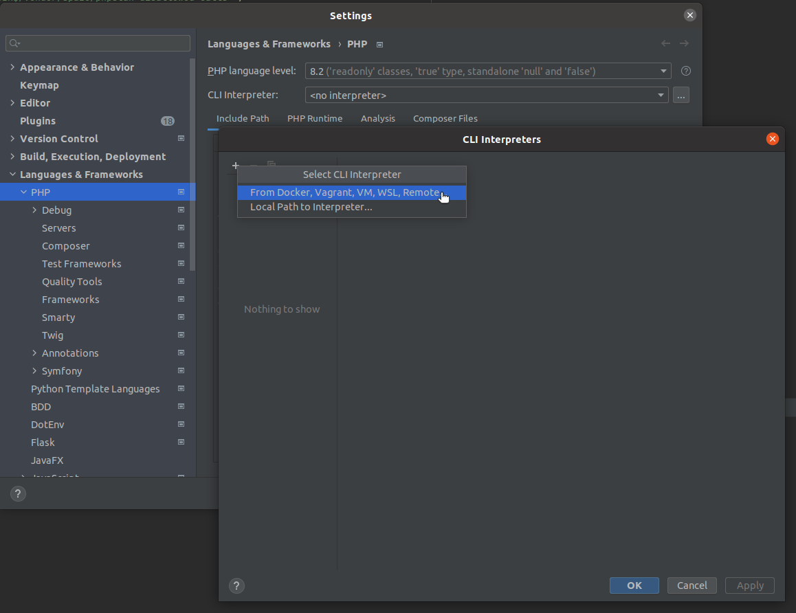
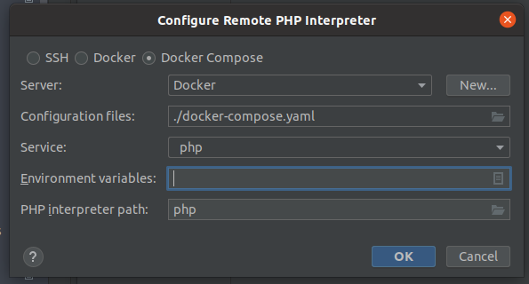
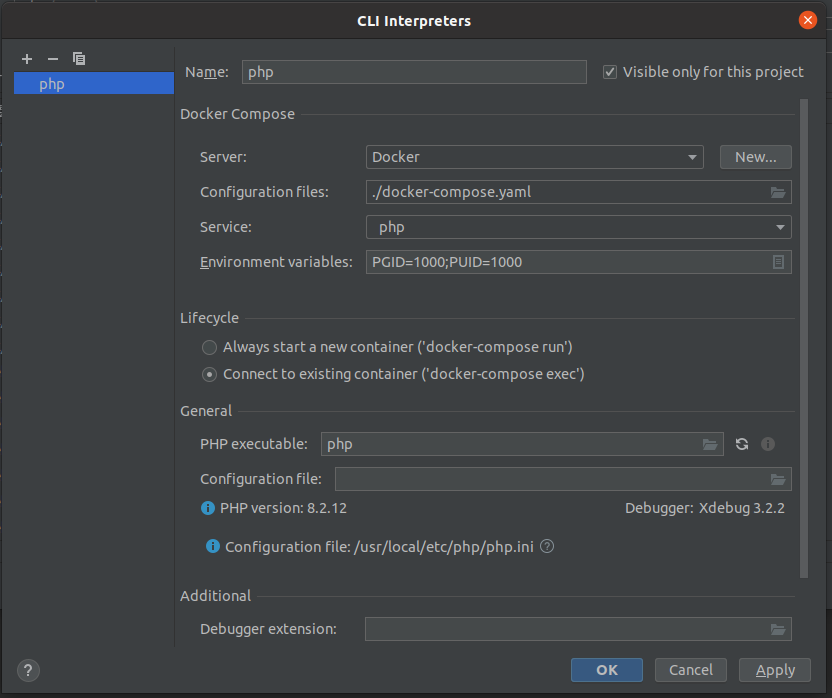
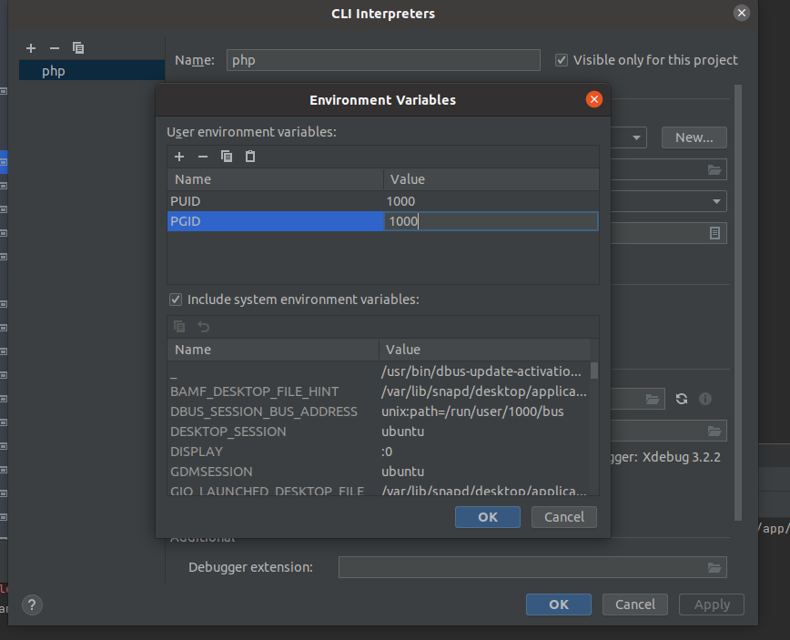
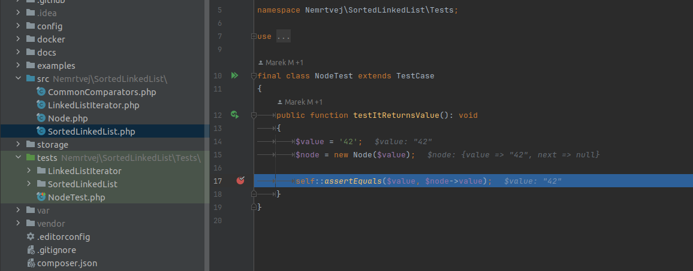

# Setting up IntelliJ IDEA

## Requirements
Make sure you have following plugins installed:
 - PHP Docker ( https://plugins.jetbrains.com/plugin/8595-php-docker )

## Setup PHP interpreter

1. Go to File => Settings
2. Go to Languages & Frameworks => PHP
3. In `CLI Interpreter` click on the tripple dot on the right.
4. Click on the + character in the newly opened window.
5. Pick the "From docker, Vagrant, VM, WSL, Remote"
   
6. Select the "Docker Compose" option and pick the service "php".
   
7. In the new window check the "Connect to existing container".
8. Make sure the Debugger and PHPUnit has been detected.
   
9. Setup environment variables (click on the rectangle on the left side)
   - Note: you might see them configured on my screenshot. They won't be configured on your machine.
10. Fill in variable PUID with the UID of your user (run `id -u` in your terminal to find the necessary value.)
11. Fill in variable PGID with the UID of your group (run `id -g` in your terminal to find the necessary value.)
    

## Setup PHPUnit

1. Go to File => Settings
2. Go to Languages & Frameworks => PHP => Test Frameworks
3. Throw away the default configuration (Main Local interpreter)
4. Click on the + sign and add a new configuration `PHPUnit by remote interpreter`.
5. Choose your previously created interpreter.
   
6. Fill path to script with `/app/vendor/autoload.php`.
7. Fill default configuration file with `/app/phpunit.xml`.
8. Open the php.xml file in your .idea/ subdirectory, find xml tag `remote_data` and replace the value of attribute DOCKER_REMOTE_PROJECT_PATH with `/app`.
9. Open file `tests/NodeTest.php` and you should see a green play button next to testitReturnsValue function. Throw a breakpoint somewhere in the body,
   click on the green button and select "Debug 'testItReturnsValue'"
   
10. Enjoy the debugger! :)
